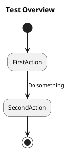

# Plant UML

Plant UML 是一個可以透過直觀的文字描述自動產生UML圖的工具，可省下許多做圖的時間，只要專注在文字邏輯的闡述即可。

編輯的文檔格視為.puml，使用文字編輯器即可以進行繪製UML。且因為是用文檔生成的，故儲存、修改上都叫一般的UML工具，在管理上方便很多。

語法不需要死背，可參考 [官方文件](https://plantuml.com/zh/)

# Fit VSCode

在VS Code 選擇PlantUML 擴充套件

建立Demo.puml

透過 alt + d 於VSCode跳出預覽談窗，可即時顯示目前編輯的plantuml圖

若無法顯示圖片，請確認是否有安裝JDK，可至[官方下載](https://www.oracle.com/java/technologies/downloads/#jdk19-windows)

